# 🧺 washingmachine-notifications

> *"I could have just asked."*
> *— Me, after spending a weekend building a serverless AWS reminder system*


A production-grade, enterprise-ready, cloud-native, infinitely-scalable solution to the age-old problem of getting someone to clean the washing machine filter.

Yes. This is real. No, I'm not sorry.

---

## The Problem

The washing machine filter needs cleaning once a week. This is a known fact. It has been a known fact for some time. Gentle reminders were issued. Sticky notes were deployed. Hope was maintained.

Hope was not enough.

---

## The Solution

Rather than have a single, normal conversation like a well-adjusted adult, I built a serverless AWS notification pipeline with:

- **Automated weekly emails** with a confirmation link and a Pushover push notification
- **Daily escalating reminders** that grow progressively more unhinged if ignored
- **A congratulations email** featuring a random animal photo upon confirmation
- **AWS Systems Manager Parameter Store** — enterprise-grade secrets management, completely free
- **CloudFront with GB-only geo restriction** — because the filter is not going to clean itself from abroad
- **Terraform / OpenTofu** — because infrastructure should be code, even for domestic chores

The filter is cleaned. The marriage survives. The cloud bill is negligible.

---

## How It Works

```mermaid
%%{init: {'theme': 'dark', 'themeVariables': {'primaryColor': '#1e3a5f', 'primaryTextColor': '#c9d1d9', 'primaryBorderColor': '#4a7ab5', 'lineColor': '#58a6ff', 'edgeLabelBackground': '#0d1117', 'clusterBkg': '#0d2137', 'clusterBorder': '#30363d'}}}%%

flowchart TD
    subgraph trigger ["⏰  Every Sunday 09:00 UK"]
        EB(["EventBridge"])
    end

    subgraph outbound ["📬  Outbound notifications"]
        direction LR
        EMAIL["📧 Email\nwith confirm link"]
        PUSH["🔔 Pushover\npush notification"]
    end

    subgraph escalation ["⚡  Daily 08:00 — while unconfirmed"]
        direction TB
        E1["Day 1 — gentle nudge"]
        E2["Day 2 — slightly concerned"]
        E3["Day 3 — the filter has feelings"]
        E4["Day 5 — legal counsel engaged"]
        E5["Day 7 — filter goes to the press"]
        EN["Day 9+ — ANOTHER DAY. STILL UNCLEAN."]
        E1 --> E2 --> E3 --> E4 --> E5 --> EN
    end

    subgraph confirm ["✅  Confirmation"]
        direction TB
        CF["☁️ CloudFront\nGB-only geo restriction"]
        GW["API Gateway\n5 req/s throttle"]
        DONE(["Task confirmed"])
    end

    REWARD["🎉 Congratulations email\n+ random animal photo"]

    EB --> EMAIL & PUSH
    EMAIL & PUSH -->|ignored| E1
    EN -.->|still ignored\nrepeats| EN
    EMAIL & PUSH -->|clicks link| CF
    CF -->|"non-GB → 403"| BLOCK(["🚫 Blocked"])
    CF -->|GB origin| GW --> DONE --> REWARD

    style trigger fill:#0d1a2e,stroke:#1e4a7a
    style outbound fill:#0d2137,stroke:#1e4a7a
    style escalation fill:#1a0d0d,stroke:#7a1e1e
    style confirm fill:#0d1a0d,stroke:#1e7a1e
    style REWARD fill:#1a2a0d,stroke:#3a7a1e,color:#90d090
    style BLOCK fill:#2a0d0d,stroke:#7a1e1e,color:#d09090
    style EN fill:#2a0d0d,stroke:#7a2a2a,color:#e0a0a0
```



---

## Escalation Ladder

| Day | Vibe |
|:---:|------|
| 1 | A gentle nudge |
| 2 | Slightly more pointed |
| 3 | The filter has feelings now |
| 4 | The filter is keeping a journal |
| 5 | Legal counsel has been engaged |
| 6 | The washing machine joins an industrial dispute |
| 7 | The filter has gone to the press |
| 8 | The filter is at peace. We are not. |
| 9+ | **ANOTHER DAY. STILL UNCLEAN.** *(repeats until heat death of the universe or confirmation, whichever comes first)* |

---

## Architecture & Security

The full technical horror is documented across three files:

| Document | Contents |
|---|---|
| [`docs/architecture.md`](docs/architecture.md) | System overview, Terraform structure, all data flows, DynamoDB model, notification channels, secrets management, test mode |
| [`docs/threat-model.md`](docs/threat-model.md) | STRIDE analysis, risk matrix, attack trees — v1.3, all medium findings resolved |
| [`docs/well-architected-review.md`](docs/well-architected-review.md) | AWS Well-Architected Framework review — 5/5 overall, all findings resolved |

**Security posture at a glance:**

| Control | Status |
|---|:---:|
| Token authentication (UUID v4, 122-bit entropy) | ✅ |
| IAM least-privilege | ✅ |
| Credentials in SSM Parameter Store SecureString (not env vars) | ✅ |
| PII in SSM Parameter Store SecureString (not env vars) | ✅ |
| KMS encryption at rest | ✅ |
| API Gateway rate limiting (5 req/s) | ✅ |
| CloudFront GB geo restriction | ✅ |
| HTTPS everywhere | ✅ |
| DynamoDB CloudTrail data events | ✅ |

---

## Setup

### Prerequisites

- An AWS account with the CLI configured
- [OpenTofu](https://opentofu.org/docs/intro/install/) (`tofu`) or [Terraform](https://developer.hashicorp.com/terraform/install)
- Python 3 and pip
- A verified SES sender email address

### Deploy

```bash
git clone https://github.com/baldrickuk/washingmachine-notifications.git
cd washingmachine-notifications

# Copy and fill in your values
cp terraform/terraform.tfvars.example terraform/terraform.tfvars
# Edit terraform/terraform.tfvars — set wife_email, wife_phone, from_email, alert_email, pushover_app_token, pushover_user_key

# Build the Lambda package
bash terraform/build.sh

# Deploy
cd terraform && tofu init && tofu apply
```

That's it. The system will now operate autonomously every Sunday until the filter is clean, the account is deleted, or civilisation collapses.

### One-time AWS setup

1. **Verify your sender email** in SES → Verified identities
2. **Request SES production access** to send to any address without pre-verification:
   ```bash
   aws sesv2 put-account-details --mail-type TRANSACTIONAL \
     --website-url https://yourdomain.com \
     --use-case-description "Weekly household filter reminder to one recipient"
   ```

### Pushover push notifications (primary channel)

Set `pushover_app_token` and `pushover_user_key` in `terraform.tfvars` to enable push notifications via [Pushover](https://pushover.net). Create a free account and register an application to obtain both values. When configured, Pushover is used for all notifications; SES email is the fallback when Pushover is not configured.

| Channel | Configuration |
|---|---|
| **Pushover** *(primary)* | `pushover_app_token`, `pushover_user_key` — create a free account at pushover.net |
| **SES Email** *(fallback)* | Always available — no extra configuration needed |

Credentials are stored in **AWS Systems Manager Parameter Store (SecureString)** automatically on deploy — never in Lambda environment variables. Encrypted at rest with AWS managed keys, completely within the free tier.

---

## Testing

```bash
# Fire the test email immediately (bypasses Sunday time check)
echo '{"test": true}' > /tmp/payload.json
aws lambda invoke \
  --function-name washingmachine-notifications-send-weekly-email \
  --payload file:///tmp/payload.json \
  --region eu-west-2 \
  --cli-binary-format raw-in-base64-out /dev/stdout
```

Test records use a `TEST#` DynamoDB key prefix and never interfere with the live weekly cycle. Re-running the test email resets the escalation counter.

To test escalating reminders every 10 minutes:
```bash
# Enable
aws events enable-rule --name washingmachine-notifications-test-sms --region eu-west-2

# Disable when done, unless you enjoy consequences
aws events disable-rule --name washingmachine-notifications-test-sms --region eu-west-2
```

---

## Running the tests

```bash
pip install -r tests/requirements.txt
python -m pytest tests/ -v
```

58 unit tests, 0.06s. No real AWS calls — fully mocked.

---

## Cost

| Service | Usage | Monthly cost |
|---|---|:---:|
| Lambda | ~10 invocations/week | Free tier |
| DynamoDB | 1 record/week, on-demand | Free tier |
| SES | ~5 emails/week | Free tier |
| CloudFront | ~5 requests/week | Free tier |
| EventBridge | 7 rules | Free |
| CloudTrail | ~40 DynamoDB events/week | Free tier |
| S3 | Audit logs (90-day retention) | Free tier |
| SSM Parameter Store | 4 SecureString parameters | Free tier |
| **Total** | | **~$0.00/month** |

The cost of *not* building this — in terms of filter-related appliance damage — is left as an exercise for the reader.

---

## Contributing

If you have found yourself in a similar domestic situation and would like to contribute improvements — perhaps support for multiple chores, a points system, or a leaderboard — pull requests are welcome.

If you have found yourself here because you *received* one of these messages: hello. The link is in the email. You know what to do.

---

## Licence

MIT. Use it freely. Build it for someone you love, or at least someone who lives with you.

> *The filter was cleaned. This readme was the hardest part.*
