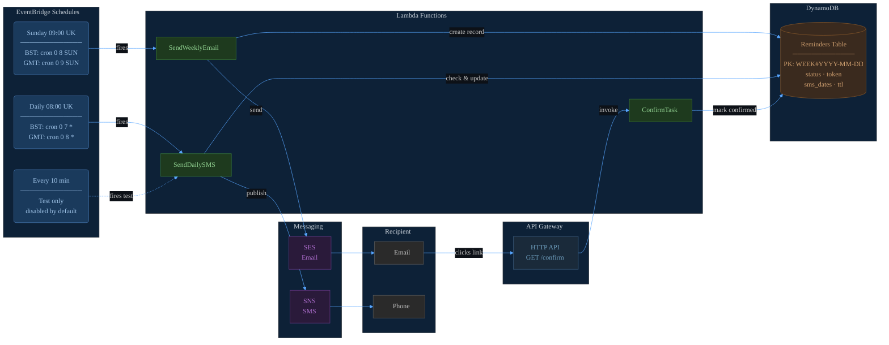
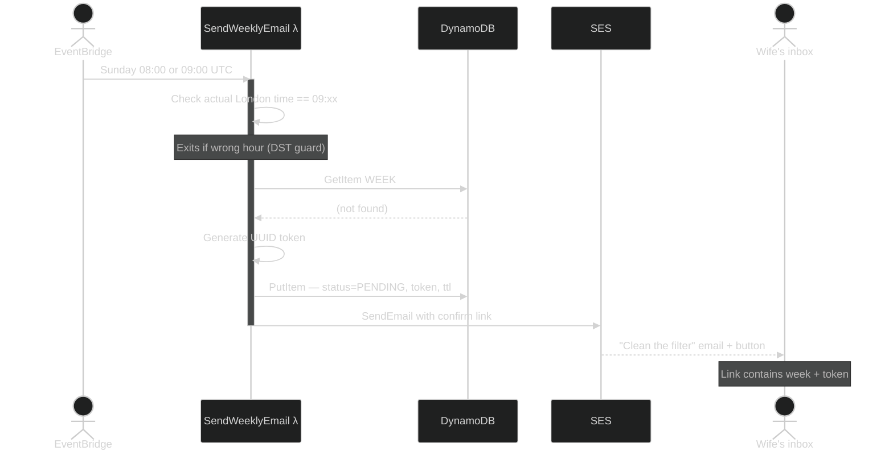
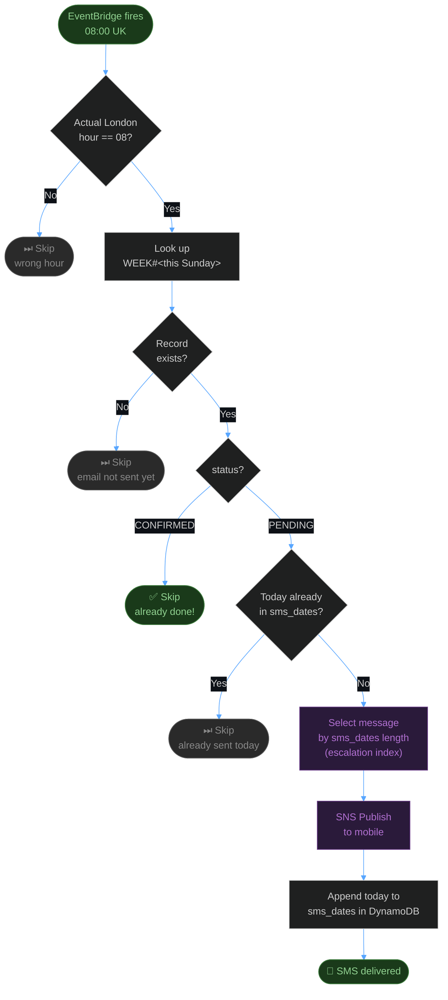
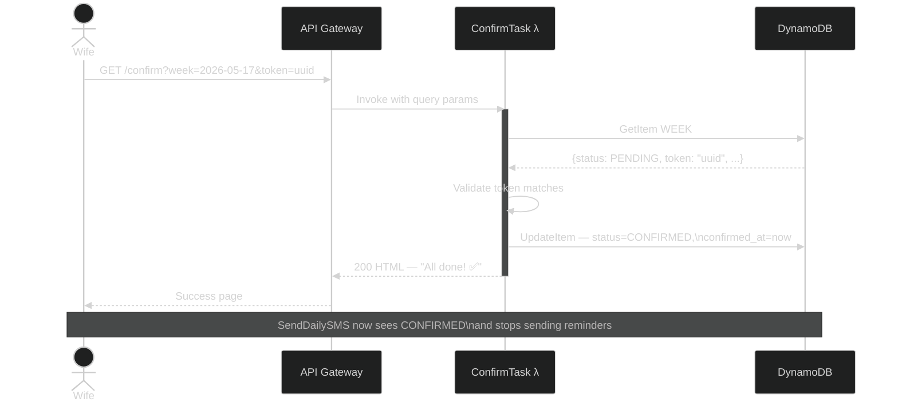
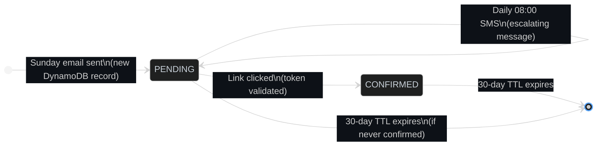

# Architecture — Washing Machine Filter Reminder

A fully serverless AWS solution that reminds a household member to clean the washing machine filter every week, escalating from a polite email to increasingly dramatic SMS messages until the task is confirmed.

---

## System Overview



---

## AWS Components

| Component | Resource | Purpose |
|---|---|---|
| **EventBridge** | 4 scheduled rules (2 prod + 1 test) | Triggers email & SMS Lambdas on schedule |
| **Lambda** × 3 | `SendWeeklyEmail`, `SendDailySMS`, `ConfirmTask` | All business logic |
| **DynamoDB** | Single table, PAY_PER_REQUEST | Tracks weekly task state (30-day TTL) |
| **SES** | Email via verified identity | Sends the weekly reminder email |
| **SNS** | Direct `Publish` to phone number | Sends escalating SMS messages |
| **API Gateway** | HTTP API, `GET /confirm` | Serves the confirmation link |
| **IAM** | Single shared role | Least-privilege access to DDB, SES, SNS |

---

## Weekly Email Flow

Fires every Sunday at 09:00 UK time. Two EventBridge rules cover GMT and BST — the Lambda checks the actual London hour and exits early if wrong.



---

## Daily SMS Reminder Flow

Fires every day at 08:00 UK time. Skips silently if the task is already confirmed or was already sent today.



---

## Confirmation Flow

When the recipient clicks the button in the email, API Gateway invokes `ConfirmTask`. The link is valid for 30 days and is single-use (token validated, status checked).



---

## DynamoDB Data Model

One record per week. The partition key encodes the task type and date, making lookups O(1).

```mermaid
%%{init: {'theme': 'dark', 'themeVariables': {'primaryColor': '#3a2a1e', 'primaryTextColor': '#c9d1d9', 'primaryBorderColor': '#8a5a2a', 'lineColor': '#d4a55a', 'edgeLabelBackground': '#0d1117'}}}%%

erDiagram
    REMINDERS_TABLE {
        string PK           "WEEK#YYYY-MM-DD (prod) or TEST#YYYY-MM-DD (test)"
        string status       "PENDING or CONFIRMED"
        string token        "UUID — validates confirmation link"
        string email_sent_at "ISO-8601 timestamp"
        list   sms_dates    "ISO dates (prod) or ISO timestamps (test)"
        string last_sms_at  "ISO timestamp — test mode dedup only"
        string confirmed_at "ISO-8601 timestamp — present when CONFIRMED"
        number ttl          "Unix epoch — DynamoDB auto-expires after 30 days"
    }
```

**Key design decisions:**

- **PAY_PER_REQUEST billing** — traffic is tiny (≤8 reads + writes per week), so on-demand is far cheaper than provisioned.
- **TTL** — records auto-delete after 30 days with no cron cleanup job needed.
- **`sms_dates` as a list** — simple append-only log. Length doubles as the escalation index with no extra counter field.
- **`TEST#` prefix** — test runs get an isolated key so they can't interfere with a real in-flight week.

---

## Task State Machine



---

## SMS Escalation Ladder

Each day without confirmation triggers the next message in the sequence. From day 9 onwards the final message repeats.

| # | Tone | Opening |
|---|---|---|
| 1 | Gentle | *"Morning! Just a reminder to clean the washing machine filter…"* |
| 2 | Nudge | *"Day 2: Still waiting on that filter! It won't clean itself (believe me, we checked)…"* |
| 3 | Dramatic | *"Day 3: The filter is starting to feel forgotten. It stares sadly at the drum…"* |
| 4 | Sentient filter | *"Day 4: The filter has begun keeping a journal. Entry 1: 'Still unclean. Still unloved.'…"* |
| 5 | Legal threats | *"Day 5: The filter has engaged legal counsel… a strongly-worded letter is being drafted…"* |
| 6 | Industrial action | *"Day 6: The washing machine has announced a work-to-rule in solidarity with the filter…"* |
| 7 | Full crisis | *"Day 7: ONE WEEK. The filter has gone to the press…'NEGLECTED FILTER SUFFERS IN SILENCE'…"* |
| 8 | Existential | *"Day 8: The filter has accepted its fate and is making peace with the universe. We have not…"* |
| 9+ | Maximum stern | *"ANOTHER DAY. STILL UNCLEAN. The filter has written its will…"* _(repeats)_ |

---

## Timezone Handling (GMT / BST)

The UK observes GMT (UTC+0) in winter and BST (UTC+1) in summer. EventBridge only understands UTC, so two rules fire per trigger — one for each possible UTC offset. The Lambda then checks `datetime.now(ZoneInfo("Europe/London")).hour` and exits immediately if it isn't the target hour.

```mermaid
%%{init: {'theme': 'dark', 'themeVariables': {'primaryColor': '#1e3a5f', 'primaryTextColor': '#c9d1d9', 'primaryBorderColor': '#4a7ab5', 'lineColor': '#58a6ff', 'edgeLabelBackground': '#0d1117'}}}%%

gantt
    title EventBridge rules firing vs. actual UK time
    dateFormat HH:mm
    axisFormat %H:%M

    section Sunday Email
    SundayEmailBST fires (08:00 UTC → 09:00 BST ✓) : milestone, 08:00, 0m
    SundayEmailGMT fires (09:00 UTC → 09:00 GMT ✓) : milestone, 09:00, 0m

    section Daily SMS
    DailySMSBST fires (07:00 UTC → 08:00 BST ✓) : milestone, 07:00, 0m
    DailySMSGMT fires (08:00 UTC → 08:00 GMT ✓) : milestone, 08:00, 0m
```



In BST the `GMT` rule fires at 10:00 UK time — the hour check rejects it immediately with no side effects.

---

## Test Mode

Passing `{"test": true}` in the Lambda event (or via the disabled EventBridge rule) activates a parallel test cycle that never touches production records.

```mermaid
%%{init: {'theme': 'dark', 'themeVariables': {'primaryColor': '#1e3a5f', 'primaryTextColor': '#c9d1d9', 'primaryBorderColor': '#4a7ab5', 'lineColor': '#58a6ff', 'edgeLabelBackground': '#0d1117'}}}%%

flowchart LR
    subgraph prod ["Production cycle  (weekly)"]
        direction TB
        P1["WEEK#2026-05-17\nstatus=PENDING"]
        P2["SMS sent daily\nat 08:00 UK"]
        P3["WEEK#2026-05-17\nstatus=CONFIRMED"]
        P1 --> P2 --> P3
    end

    subgraph test ["Test cycle  (every 10 min)"]
        direction TB
        T1["TEST#2026-05-16\nstatus=PENDING\n(reset on each test email)"]
        T2["SMS sent every\n10 minutes"]
        T3["TEST#2026-05-16\nstatus=CONFIRMED"]
        T1 --> T2 --> T3
    end

    style prod fill:#0d2137,stroke:#1e4a7a
    style test fill:#1a2a0d,stroke:#3a5a1a
```



| Behaviour | Production | Test |
|---|---|---|
| Email trigger | EventBridge, Sunday 09:00 UK | Manual invoke with `{"test": true}` |
| DynamoDB key | `WEEK#YYYY-MM-DD` | `TEST#YYYY-MM-DD` |
| Time guard | Exits if not correct UK hour | Bypassed |
| SMS dedup | Once per calendar day | Once per 10 minutes |
| Email subject | Normal | Prefixed with `[TEST]` |
| Email banner | None | Orange "TEST MODE" banner |
| Confirm link | `…&token=…` | `…&token=…&test=1` |

**To run a test cycle:**

```bash
# 1. Trigger the test email (can re-run to reset the SMS counter)
aws lambda invoke \
  --function-name washingmachine-notifications-SendWeeklyEmailFunction \
  --payload '{"test": true}' \
  --profile dev /dev/stdout

# 2. Enable the 10-minute SMS rule in the AWS Console:
#    EventBridge → Rules → TestSMSEvery10Min → Enable

# 3. Disable the rule when finished
```

---

## Deployment

```bash
# Prerequisites: AWS CLI + SAM CLI installed, AWS profile configured

cp samconfig.toml.example samconfig.toml
# Edit samconfig.toml — set WifeEmail, WifePhone (+44...), FromEmail

sam build && sam deploy
```

**One-time AWS setup required before first deploy:**

1. **SES → Verified identities** — verify your sender address (and recipient address if still in SES sandbox)
2. **SES production access** — request via AWS Console to send to unverified addresses
3. **SNS → Text messaging** — raise the default $1/month SMS spend limit for production use
