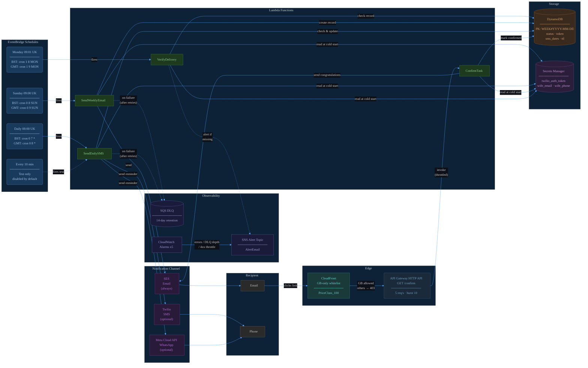
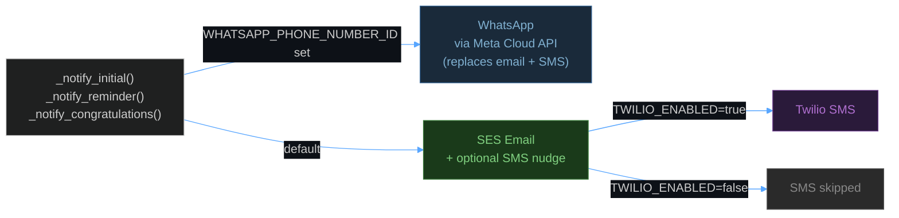
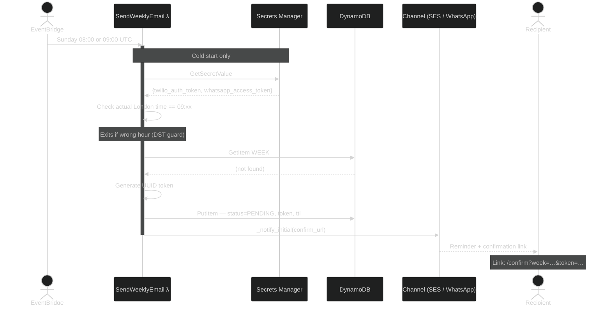
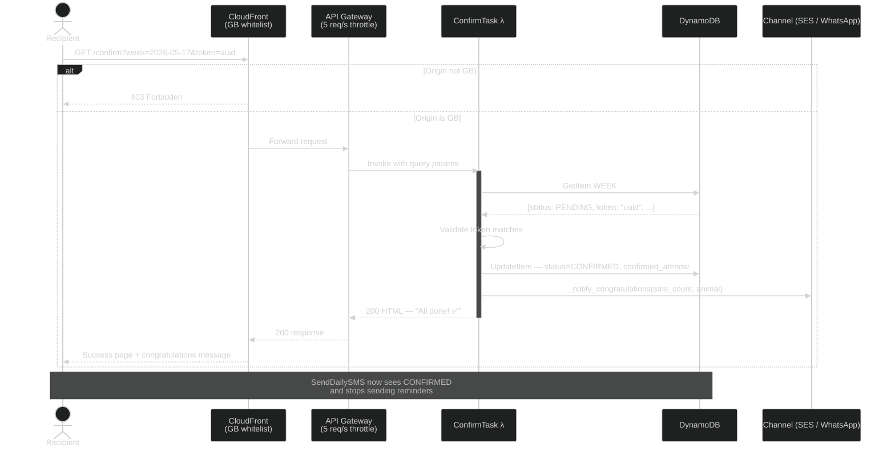
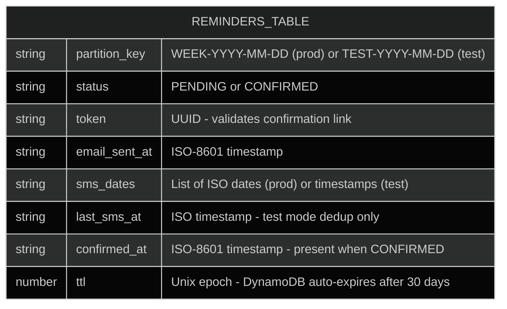
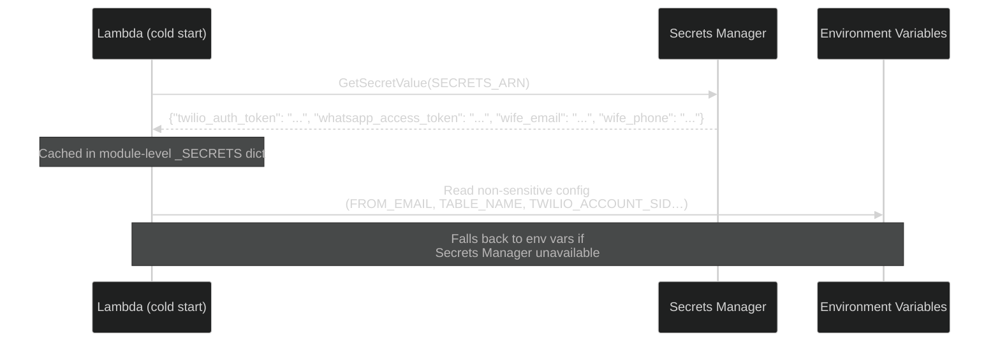
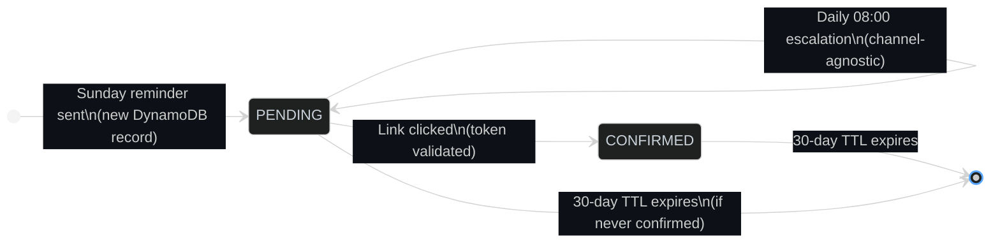
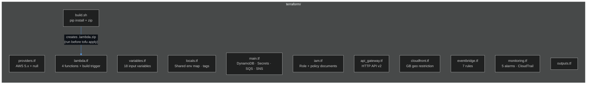

# Architecture — Washing Machine Filter Reminder

A fully serverless AWS solution that reminds a household member to clean the washing machine filter every week, escalating through increasingly dramatic messages until the task is confirmed.

---

## System Overview



---

## AWS Components

| Component | Resource | Purpose |
|---|---|---|
| **EventBridge** | 7 scheduled rules (6 prod + 1 test) | Triggers all four Lambda functions on schedule |
| **Lambda** × 4 | `SendWeeklyEmail`, `SendDailySMS`, `ConfirmTask`, `VerifyDelivery` | All business logic — arm64 Graviton2, 256 MB |
| **DynamoDB** | Single table, PAY_PER_REQUEST | Tracks weekly task state (30-day TTL) |
| **Secrets Manager** | `washingmachine-notifications/secrets` | Stores credentials and recipient PII |
| **SES** | Email via verified identity | Sends reminder and congratulations emails |
| **CloudFront** | Distribution, `PriceClass_100`, GB whitelist | GB-only geo restriction at the CDN edge — non-GB requests never reach the origin |
| **API Gateway** | HTTP API v2, `GET /confirm`, throttled 5 req/s | Confirmation link origin behind CloudFront |
| **SQS** | Dead letter queue, 14-day retention | Catches Lambda events that fail after all retries |
| **CloudWatch** | 5 metric alarms | Monitors Lambda errors, DLQ depth, and API Gateway 4xx throttling |
| **SNS** | Alert topic → `alert_email` | Delivers operational alerts via email |
| **CloudTrail** | Trail + S3 audit bucket | DynamoDB data event audit log (90-day retention) |
| **IAM** | Single shared role | Least-privilege access to DDB, SES, Secrets Manager, SQS, SNS |

---

## Notification Channels

The system supports three delivery channels, selected by configuration. Email is always available; SMS and WhatsApp are opt-in.



| `WHATSAPP_*` set | `TWILIO_ENABLED` | Channel used |
|:---:|:---:|---|
| No | false | Email only (default) |
| No | true | Email + Twilio SMS |
| Yes | — | WhatsApp only (no email) |

---

## Weekly Reminder Flow

Fires every Sunday at 09:00 UK time. Two EventBridge rules cover GMT and BST — the Lambda checks the actual London hour and exits early if wrong. Credentials are fetched from Secrets Manager on cold start.



---

## Daily Reminder Flow

Fires every day at 08:00 UK time. Skips silently if the task is already confirmed or a reminder was already sent today.


---

## Confirmation Flow

When the recipient clicks the confirmation link it passes through CloudFront (GB geo check) then API Gateway (rate limit) before invoking `ConfirmTask`. The link is valid for 30 days; clicking it again after confirmation is a no-op.



---

## DynamoDB Data Model

One record per week. The partition key encodes the task type and date, making lookups O(1).



**Key design decisions:**

- **PAY_PER_REQUEST billing** — traffic is tiny (≤8 reads + writes per week), so on-demand is far cheaper than provisioned.
- **TTL** — records auto-delete after 30 days with no cron cleanup job needed.
- **`sms_dates` as a list** — simple append-only log. Length doubles as the escalation index with no extra counter field.
- **`TEST#` prefix** — test runs get an isolated key so they can't interfere with a real in-flight week.

---

## Secrets Management

Sensitive credentials are stored in AWS Secrets Manager and fetched once per Lambda cold start, then cached in memory for the instance lifetime.



| Secret | Location | Visible in Lambda config? |
|---|---|:---:|
| `twilio_auth_token` | Secrets Manager | No |
| `whatsapp_access_token` | Secrets Manager | No |
| `wife_email` | Secrets Manager | No |
| `wife_phone` | Secrets Manager | No |
| `FROM_EMAIL` | Environment variable | Yes (sender address — not PII) |
| `TWILIO_ACCOUNT_SID` | Environment variable | Yes (identifier, not credential) |

---

## Task State Machine



---

## Reminder Escalation Ladder

Each day without confirmation triggers the next message in the sequence. From day 9 onwards the final message repeats. Works across all channels (email body, SMS, WhatsApp).

| # | Tone | Opening |
|---|---|---|
| 1 | Gentle | *"Morning! Just a reminder to clean the washing machine filter…"* |
| 2 | Nudge | *"Day 2: Still waiting on that filter! It won't clean itself (believe me, we checked)…"* |
| 3 | Dramatic | *"Day 3: The filter is starting to feel forgotten. It stares sadly at the drum…"* |
| 4 | Sentient filter | *"Day 4: The filter has begun keeping a journal. Entry 1: 'Still unclean. Still unloved.'…"* |
| 5 | Legal threats | *"Day 5: The filter has engaged legal counsel… a strongly-worded letter is being drafted…"* |
| 6 | Industrial action | *"Day 6: The washing machine has announced a work-to-rule in solidarity with the filter…"* |
| 7 | Full crisis | *"Day 7: ONE WEEK. The filter has gone to the press…'NEGLECTED FILTER SUFFERS IN SILENCE'…"* |
| 8 | Existential | *"Day 8: The filter has accepted its fate and is making peace with the universe. We have not…"* |
| 9+ | Maximum stern | *"ANOTHER DAY. STILL UNCLEAN. The filter has written its will…"* _(repeats)_ |

---

## Timezone Handling (GMT / BST)

The UK observes GMT (UTC+0) in winter and BST (UTC+1) in summer. EventBridge only understands UTC, so two rules fire per trigger — one for each possible UTC offset. The Lambda checks `datetime.now(ZoneInfo("Europe/London")).hour` and exits immediately if it isn't the target hour.


In BST the `GMT` rule fires at 10:00 UK time — the hour check rejects it immediately with no side effects.

---

## Test Mode

Passing `{"test": true}` in the Lambda event activates a parallel test cycle that never touches production records.

```mermaid
%%{init: {'theme': 'dark', 'themeVariables': {'primaryColor': '#1e3a5f', 'primaryTextColor': '#c9d1d9', 'primaryBorderColor': '#4a7ab5', 'lineColor': '#58a6ff', 'edgeLabelBackground': '#0d1117'}}}%%

flowchart LR
    subgraph prod ["Production cycle  (weekly)"]
        direction TB
        P1["WEEK#2026-05-17\nstatus=PENDING"]
        P2["Reminder sent daily\nat 08:00 UK"]
        P3["WEEK#2026-05-17\nstatus=CONFIRMED"]
        P1 --> P2 --> P3
    end

    subgraph test ["Test cycle  (every 10 min)"]
        direction TB
        T1["TEST#2026-05-16\nstatus=PENDING\n(reset on each test trigger)"]
        T2["Reminder sent every\n10 minutes"]
        T3["TEST#2026-05-16\nstatus=CONFIRMED"]
        T1 --> T2 --> T3
    end

    style prod fill:#0d2137,stroke:#1e4a7a
    style test fill:#1a2a0d,stroke:#3a5a1a
```



| Behaviour | Production | Test |
|---|---|---|
| Trigger | EventBridge, Sunday 09:00 UK | Manual invoke with `{"test": true}` |
| DynamoDB key | `WEEK#YYYY-MM-DD` | `TEST#YYYY-MM-DD` |
| Time guard | Exits if not correct UK hour | Bypassed |
| Reminder dedup | Once per calendar day | Once per 10 minutes |
| Email subject | Normal | Prefixed with `[TEST]` |
| Email banner | None | Orange "TEST MODE" banner |
| Confirm link | `…&token=…` | `…&token=…&test=1` |

**To run a test cycle:**

```bash
# 1. Trigger the test reminder (re-run to reset the escalation counter)
echo '{"test": true}' > /tmp/payload.json
aws lambda invoke \
  --function-name washingmachine-notifications-send-weekly-email \
  --payload file:///tmp/payload.json \
  --region eu-west-2 \
  --cli-binary-format raw-in-base64-out /dev/stdout

# 2. Enable the 10-minute test rule (Terraform manages the name deterministically)
aws events enable-rule \
  --name washingmachine-notifications-test-sms \
  --region eu-west-2

# 3. Disable when finished
aws events disable-rule \
  --name washingmachine-notifications-test-sms \
  --region eu-west-2
```

---

## Operational Monitoring

Five CloudWatch alarms cover all critical failure paths. All route to an SNS topic which delivers email to the configured `AlertEmail` address.

```mermaid
%%{init: {'theme': 'dark', 'themeVariables': {'primaryColor': '#1e3a5f', 'primaryTextColor': '#c9d1d9', 'primaryBorderColor': '#4a7ab5', 'lineColor': '#58a6ff', 'edgeLabelBackground': '#0d1117'}}}%%

flowchart LR
    subgraph alarms ["CloudWatch Alarms"]
        A1["weekly-email-errors\nLambda Errors >= 1"]
        A2["daily-sms-errors\nLambda Errors >= 1"]
        A3["confirm-task-errors\nLambda Errors >= 1"]
        A4["dlq-depth\nMessages > 0"]
        A5["api-throttling\n4xx > 5 per 5min"]
    end

    subgraph sources ["Monitored resources"]
        L1["SendWeeklyEmail λ"]
        L2["SendDailySMS λ"]
        L3["ConfirmTask λ"]
        DLQ[("SQS DLQ")]
        GW["API Gateway"]
    end

    L1 -->|Errors metric| A1
    L2 -->|Errors metric| A2
    L3 -->|Errors metric| A3
    L1 & L2 -.->|on failure| DLQ
    DLQ -->|ApproximateNumberOfMessagesVisible| A4
    GW -->|4xx metric| A5

    A1 & A2 & A3 & A4 & A5 -->|ALARM state| SNS["SNS Alert Topic"]
    SNS -->|email| ADMIN["AlertEmail"]

    style alarms fill:#1a1a3a,stroke:#5a5a9a
    style sources fill:#0d2137,stroke:#1e4a7a
```



| Alarm | Metric | Threshold | What it means |
|---|---|:---:|---|
| `weekly-email-errors` | Lambda `Errors` | ≥ 1 | Sunday email may not have been sent |
| `daily-sms-errors` | Lambda `Errors` | ≥ 1 | A daily escalation may have been missed |
| `confirm-task-errors` | Lambda `Errors` | ≥ 1 | A confirmation attempt may have failed |
| `dlq-depth` | SQS `ApproximateNumberOfMessagesVisible` | > 0 | A Lambda failed after all retries — event is preserved for inspection |
| `api-throttling` | API Gateway `4xx` | > 5 / 5 min | Rate limit being hit — likely unusual traffic through CloudFront |

**Dead Letter Queue:** `SendWeeklyEmail` and `SendDailySMS` both write to the DLQ after exhausting Lambda's built-in retry attempts (2 retries). Messages are retained for 14 days. `ConfirmTask` is excluded — it is invoked synchronously by API Gateway, so the DLQ mechanism does not apply.

---

## Infrastructure

All AWS resources are managed with **Terraform / OpenTofu** in the `terraform/` directory. The configuration is compatible with both `tofu` (OpenTofu) and `terraform` CLIs.



**Resource naming** is deterministic (`{stack_name}-{resource}`), e.g.:
- `washingmachine-notifications-send-weekly-email`
- `washingmachine-notifications-reminders`
- `washingmachine-notifications-dlq`

All resources are tagged via the provider `default_tags` block: `Project`, `Environment`, `ManagedBy=opentofu`.

---

## Deployment

**Prerequisites:** OpenTofu (`tofu`) or Terraform, AWS CLI configured, Python 3.

```bash
# First deploy only — copy and fill in your values
cp terraform/terraform.tfvars.example terraform/terraform.tfvars
# Edit terraform/terraform.tfvars — set wife_email, wife_phone, from_email, alert_email

# Build the Lambda package (re-run whenever src/handlers/ changes)
bash terraform/build.sh

# Deploy
cd terraform
tofu init
tofu apply
```

**One-time AWS setup required before first deploy:**

1. **SES → Verified identities** — verify your sender address (`guy@dunite.uk`)
2. **SES production access** — request via the AWS Console or:
   ```bash
   aws sesv2 put-account-details --mail-type TRANSACTIONAL \
     --website-url https://yourdomain.com \
     --use-case-description "Weekly household filter reminder"
   ```
3. **Secrets Manager** — populated automatically by `tofu apply` from `terraform.tfvars` values

**Optional channels:**

| Channel | `terraform.tfvars` variables to set |
|---|---|
| Twilio SMS | `twilio_enabled = "true"`, `twilio_account_sid`, `twilio_auth_token`, `twilio_from_number` |
| WhatsApp | `whatsapp_phone_number_id`, `whatsapp_access_token`, create three approved Meta message templates |
