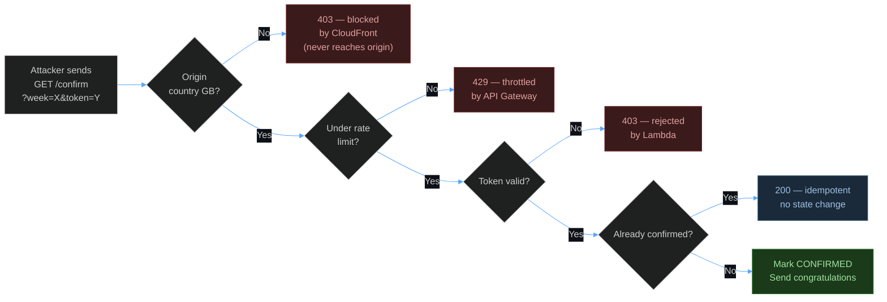
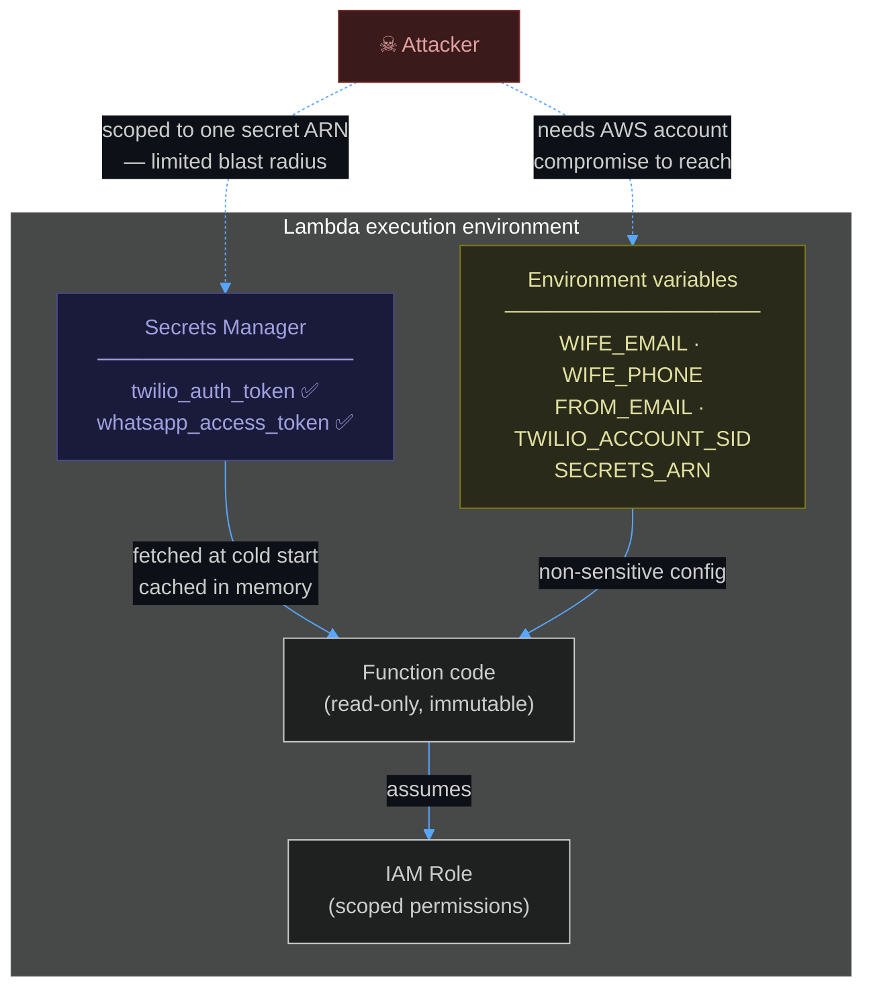
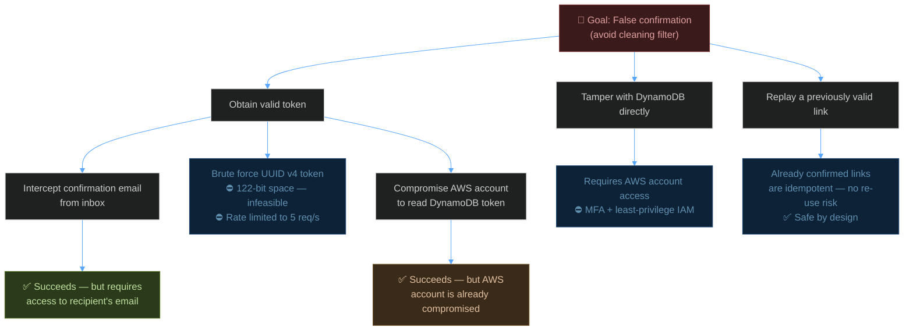
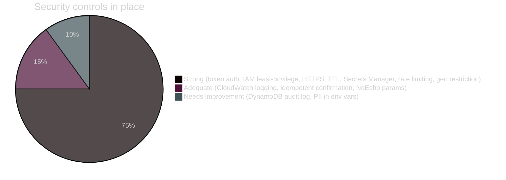

# Threat Model — Washing Machine Filter Reminder

> *This document applies enterprise-grade security analysis to a system whose primary adversary is domestic inertia. It is written in earnest.*

---

## Scope & Assumptions

**In scope:** All components of the reminder pipeline — API Gateway, Lambda functions, DynamoDB, SES, Secrets Manager, and the confirmation flow.

**Out of scope:** The washing machine itself, the filter, and the feelings of either.

**Assumptions:**
- The AWS account is managed responsibly and MFA is enabled
- `samconfig.toml` is gitignored and never committed
- The recipient is assumed to be non-malicious, merely busy

---

## System Data Flow & Trust Boundaries

```mermaid
%%{init: {'theme': 'dark', 'themeVariables': {'primaryColor': '#1e3a5f', 'primaryTextColor': '#c9d1d9', 'primaryBorderColor': '#4a7ab5', 'lineColor': '#58a6ff', 'edgeLabelBackground': '#0d1117', 'clusterBkg': '#0d1a2e', 'clusterBorder': '#30363d'}}}%%

flowchart TD
    subgraph internet ["🌐  Internet (Untrusted)"]
        USER["Recipient\n(browser / email client)"]
    end

    subgraph aws ["☁️  AWS Account (Trusted boundary)"]
        subgraph sched ["EventBridge"]
            EB["Scheduled rules\n(cron — no external trigger)"]
        end

        subgraph compute ["Lambda"]
            L1["SendWeeklyEmail"]
            L2["SendDailySMS"]
            L3["ConfirmTask"]
        end

        subgraph storage ["DynamoDB"]
            DB[("Reminders table\nPK · status · token · ttl")]
        end

        subgraph secrets ["Secrets Manager"]
            SM[("washingmachine-notifications/secrets\ntwilio_auth_token\nwhatsapp_access_token")]
        end

        subgraph edge ["CloudFront + API Gateway"]
            CF["CloudFront\nGB whitelist\n(non-GB → 403)"]
            GW["GET /confirm\n(throttled: 5 req/s · burst 10)"]
        end
    end

    subgraph saas ["🔌  External SaaS"]
        SES["AWS SES\n(email delivery)"]
        TWILIO["Twilio\n(SMS — optional)"]
        WA["Meta Cloud API\n(WhatsApp — optional)"]
    end

    EB -->|"scheduled invoke\n(no user input)"| L1
    EB -->|"scheduled invoke"| L2
    L1 & L2 & L3 -->|"GetSecretValue\n(cold start)"| SM
    L1 -->|"read/write"| DB
    L2 -->|"read/write"| DB
    L3 -->|"read/write"| DB
    L1 -->|"send email\n(confirm URL + token)"| SES
    L2 -->|"send reminder\n(channel-agnostic)"| TWILIO
    L2 -->|"send reminder"| WA
    SES -->|"SMTP/TLS"| USER
    TWILIO -->|"SMPP"| USER
    WA -->|"HTTPS"| USER
    USER -->|"HTTPS GET\n?week=…&token=…"| CF
    CF -->|"GB only\nothers → 403"| GW
    GW -->|"invoke\n(rate limited)"| L3
    L3 -->|"send congratulations"| SES

    classDef trust fill:#0d2137,stroke:#1e4a7a
    classDef untrust fill:#2a1a1a,stroke:#7a1e1e
    classDef saas fill:#1a2a1a,stroke:#2a5a2a
    classDef secured fill:#1a1a3a,stroke:#4a4a8a
```



---

## STRIDE Analysis

### Component: CloudFront + API Gateway — `GET /confirm`

The only internet-facing surface. Requests pass through CloudFront (GB geo restriction) before reaching API Gateway (5 req/s rate limit). Non-GB requests are rejected at the CDN edge and never reach the origin.



| Threat | Description | Likelihood | Impact | Mitigation |
|--------|-------------|:----------:|:------:|------------|
| **S** Spoofing token | Attacker guesses or brutes a valid `?token=` | 🟢 Very Low | 🟡 Medium | UUID v4 = 122 bits entropy. Non-GB attackers blocked at CloudFront before they can even try. |
| **T** Parameter tampering | Manipulating `week` or `token` values | 🟢 Very Low | 🟢 Low | Invalid combinations return 403/404; no state is changed |
| **R** Repudiation | No proof of who clicked the link | 🟡 Medium | 🟡 Medium | `confirmed_at` timestamp written to DynamoDB; CloudWatch logs record the Lambda invocation |
| **I** Information disclosure | Error pages leaking internals | 🟢 Very Low | 🟢 Low | HTML error pages return no stack traces or internal details |
| **D** Denial of service | Flooding the `/confirm` endpoint | ✅ ~~Medium~~ → Very Low | 🟢 Low | **Resolved (finding #2 + geo):** Non-GB traffic blocked at CloudFront edge. GB traffic rate limited to 5 req/s, burst 10. |
| **E** Elevation of privilege | Gaining broader AWS access via the endpoint | 🟢 Very Low | 🔴 High | `ConfirmTask` IAM role scoped to DDB actions on one table, `ses:SendEmail`, and `secretsmanager:GetSecretValue` on one secret |
| **D** Geo bypass | Attacker uses GB-based VPN or proxy | 🟡 Medium | 🟢 Low | Acceptable residual risk — token brute force remains infeasible regardless of origin country; geo restriction reduces noise, not a cryptographic guarantee |

---

### Component: Lambda Functions



| Threat | Description | Likelihood | Impact | Mitigation |
|--------|-------------|:----------:|:------:|------------|
| **S** Spoofing EventBridge source | Fake scheduled events triggering Lambdas | 🟢 Very Low | 🟡 Medium | EventBridge invokes Lambda via resource-based policy; only this account's rules can trigger |
| **T** Code tampering | Attacker modifying Lambda code | 🟢 Very Low | 🔴 High | Requires AWS account compromise; mitigated by MFA and least-privilege IAM |
| **I** Credential exposure | Auth tokens accessible via Lambda config | ✅ ~~Medium~~ → Very Low | 🔴 High | **Resolved (finding #1):** `twilio_auth_token` and `whatsapp_access_token` moved to Secrets Manager. IAM scoped to the specific secret ARN. Tokens no longer appear in `lambda:GetFunctionConfiguration` output. |
| **I** PII in environment | `WIFE_EMAIL` and `WIFE_PHONE` in Lambda config | 🟡 Medium | 🟡 Medium | Visible to any IAM principal with `lambda:GetFunctionConfiguration`. Restrict this permission. Consider migrating to Secrets Manager. |
| **D** Lambda throttling | Concurrent invocations exhausted | 🟢 Very Low | 🟢 Low | Functions run at most a handful of times per day; account concurrency limits are not a realistic concern |

---

### Component: Secrets Manager

| Threat | Description | Likelihood | Impact | Mitigation |
|--------|-------------|:----------:|:------:|------------|
| **S** Unauthorised secret access | Actor reads credentials without permission | 🟢 Very Low | 🔴 High | IAM policy grants `secretsmanager:GetSecretValue` on the specific secret ARN only; no wildcard resource |
| **T** Secret value tampering | Credentials overwritten with invalid values | 🟢 Very Low | 🟡 Medium | Requires `secretsmanager:PutSecretValue` which is not granted to the Lambda role; only account admins can update |
| **I** Secret in CloudFormation events | Raw values visible in CloudFormation change set during deploy | 🟡 Medium | 🔴 High | Use `NoEcho: true` on sensitive parameters (applied). Restrict CloudFormation stack event access to admin roles. |
| **D** Secrets Manager unavailable | Cold start fails to fetch credentials | 🟢 Very Low | 🟡 Medium | Code falls back to env vars (empty for prod). SES email still functions. Twilio/WhatsApp silently disabled. |

---

### Component: DynamoDB

| Threat | Description | Likelihood | Impact | Mitigation |
|--------|-------------|:----------:|:------:|------------|
| **T** Record tampering | Directly modifying task status or token | 🟢 Very Low | 🟡 Medium | Only the Lambda IAM role has DynamoDB access; no public endpoint |
| **R** No data-plane audit log | DynamoDB reads/writes not in CloudTrail by default | 🟡 Medium | 🟡 Medium | ⚠ **Open (finding #3).** Enable CloudTrail data events for the table. |
| **I** PII at rest | `sms_dates`, timestamps, status readable by account admins | 🟢 Low | 🟢 Low | Minimal PII stored; email addresses and phone numbers are in Lambda env only, not in the table |
| **D** Record flood | Attacker creating unlimited DynamoDB items | 🟢 Very Low | 🟡 Medium | All writes go through Lambda; no write path is publicly exposed |

---

### Component: Email Delivery (SES)

| Threat | Description | Likelihood | Impact | Mitigation |
|--------|-------------|:----------:|:------:|------------|
| **S** Email spoofing | Third party spoofing `guy@dunite.uk` | 🟡 Medium | 🟡 Medium | Ensure SPF and DKIM records are published for `dunite.uk`; SES handles DKIM signing automatically for verified domains |
| **T** Confirmation link interception | Link captured in transit or from inbox | 🟡 Medium | 🟡 Medium | Link is HTTPS; token is single-purpose; if clicked after already confirmed it is a no-op |
| **I** Link forwarding | Recipient forwards email; third party confirms | 🟡 Medium | 🟢 Low | Acceptable risk for this threat model. Worst case: filter recorded as cleaned when it wasn't — a domestic inconvenience, not a security incident |
| **D** SES sending quota | Production access granted; rate: 1/sec | 🟢 Very Low | 🟢 Low | Production access requested; system sends ~1–10 emails/week maximum |

---

## Risk Matrix

Findings #1 (credentials) and #2 (rate limiting) have been resolved, moving those risks materially left and down.

```mermaid
%%{init: {'theme': 'dark', 'themeVariables': {'primaryColor': '#1e3a5f', 'primaryTextColor': '#c9d1d9', 'primaryBorderColor': '#4a7ab5', 'lineColor': '#58a6ff', 'edgeLabelBackground': '#0d1117'}}}%%

quadrantChart
    title Risk Matrix — Likelihood vs Impact (post-remediation)
    x-axis Low Impact --> High Impact
    y-axis Low Likelihood --> High Likelihood

    quadrant-1 Monitor
    quadrant-2 Prioritise
    quadrant-3 Accept
    quadrant-4 Mitigate

    Token brute force: [0.10, 0.03]
    API Gateway DoS (resolved): [0.20, 0.10]
    Email link interception: [0.42, 0.40]
    Credential exposure (resolved): [0.75, 0.10]
    Lambda code tampering: [0.80, 0.08]
    Email spoofing: [0.40, 0.50]
    No DynamoDB audit log: [0.38, 0.55]
    Link forwarding: [0.15, 0.55]
    PII in Lambda env: [0.40, 0.45]
    SM in CloudFormation events: [0.65, 0.45]
```

---

## Attack Tree — False Confirmation

The highest-value attack: convincing the system the filter has been cleaned when it hasn't.



**Conclusion:** The realistic attack path is email inbox access. This is outside the system's control — it is a property of the recipient's email security posture, not this application's.

---

## Findings & Recommendations

### ✅ Resolved

| # | Finding | Resolution |
|---|---------|------------|
| 1 | **Credentials stored as Lambda environment variables** | Moved `twilio_auth_token` and `whatsapp_access_token` to **AWS Secrets Manager** (`washingmachine-notifications/secrets`). Fetched at cold start, cached in memory, never visible in Lambda config. IAM scoped to the specific secret ARN. |
| 2 | **No API Gateway rate limiting** | `/confirm` endpoint throttled to **5 req/s sustained, burst of 10** via `DefaultRouteSettings` on the HTTP API stage. Excess requests receive 429 before Lambda is invoked. |

### 🟡 Medium Priority — Open

| # | Finding | Recommendation |
|---|---------|---------------|
| 3 | **No DynamoDB CloudTrail data events** — reads and writes to the reminders table are not audited | Enable **CloudTrail data event logging** for the table. Cost is negligible at this volume. |
| 4 | **PII in Lambda environment** — `WIFE_EMAIL` and `WIFE_PHONE` visible in function config | Restrict `lambda:GetFunctionConfiguration` in the AWS account IAM policy to admin roles only. Consider migrating to Secrets Manager. |
| 5 | **Secrets Manager values in CloudFormation events** — raw token values flow through CloudFormation change set during deploy | Parameters marked `NoEcho: true` (done). Additionally restrict CloudFormation stack event access to admin IAM roles only. |

### 🟢 Low Priority / Informational

| # | Finding | Recommendation |
|---|---------|---------------|
| 6 | **No confirmation non-repudiation** — only a timestamp proves the link was clicked, not who clicked it | Acceptable for this use case. If stronger proof is needed, log the User-Agent and source IP in CloudWatch. |
| 7 | **SPF/DKIM for `dunite.uk`** — SES signs outbound email, but SPF/DKIM records must be published in DNS | Verify in SES console that `dunite.uk` DKIM records are active. Check [MXToolbox](https://mxtoolbox.com) for SPF coverage. |
| 8 | **Test EventBridge rule left in stack** — `TestSMSEvery10Min` rule exists (disabled) | Acceptable — it is disabled by default. Consider removing from the template post-testing to reduce attack surface. |

---

## Security Posture Summary



| Area | Status |
|------|--------|
| Authentication | ✅ UUID v4 token — cryptographically strong |
| Authorisation | ✅ IAM roles scoped to minimum required actions |
| Encryption in transit | ✅ HTTPS enforced on CloudFront and API Gateway; SES uses TLS |
| Encryption at rest | ✅ DynamoDB encrypted at rest by default |
| Secrets management | ✅ Auth tokens in Secrets Manager — not in Lambda env vars |
| Rate limiting | ✅ `/confirm` throttled to 5 req/s, burst 10 |
| Geo restriction | ✅ CloudFront GB-only whitelist — non-GB requests blocked at the edge |
| Audit logging | ⚠️ CloudWatch logs Lambda; DynamoDB data events not enabled |
| PII protection | ⚠️ Email and phone in Lambda env vars — restrict `GetFunctionConfiguration` |
| Input validation | ✅ `week` parsed as ISO date; token compared server-side |
| Dependency supply chain | ✅ Minimal dependencies (`boto3`, optional `twilio`) |

---

*Threat model version 1.2 — May 2026. Findings #1 and #2 resolved. CloudFront GB geo restriction added. Review annually or when the architecture changes materially. Or when the filter starts answering back.*
