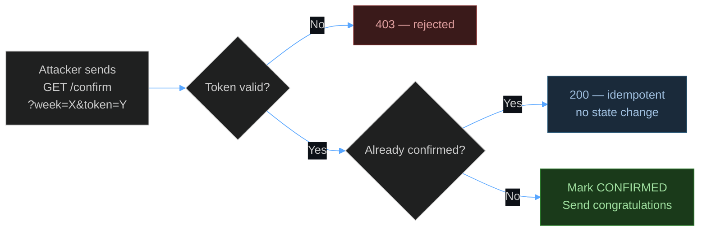
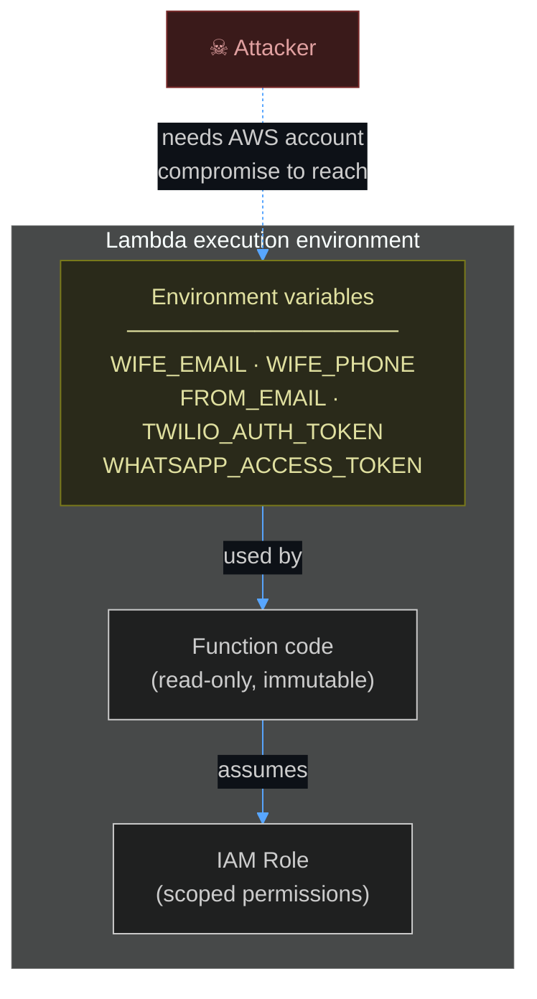
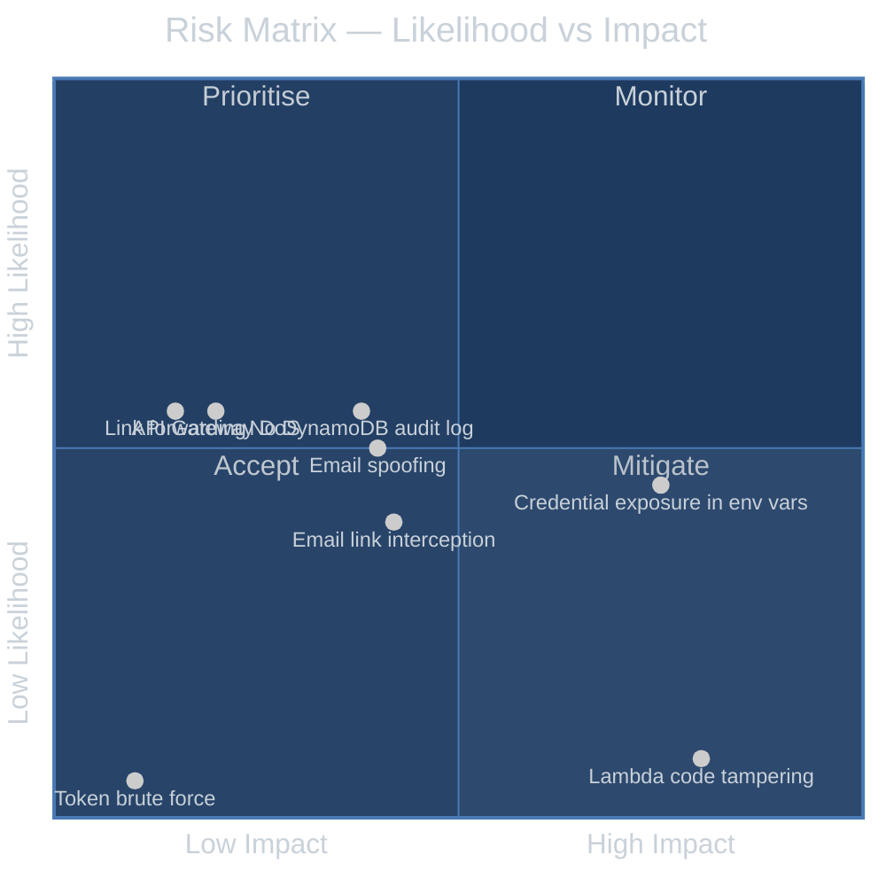
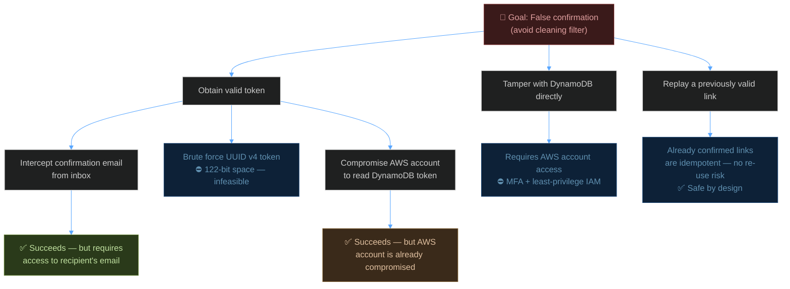
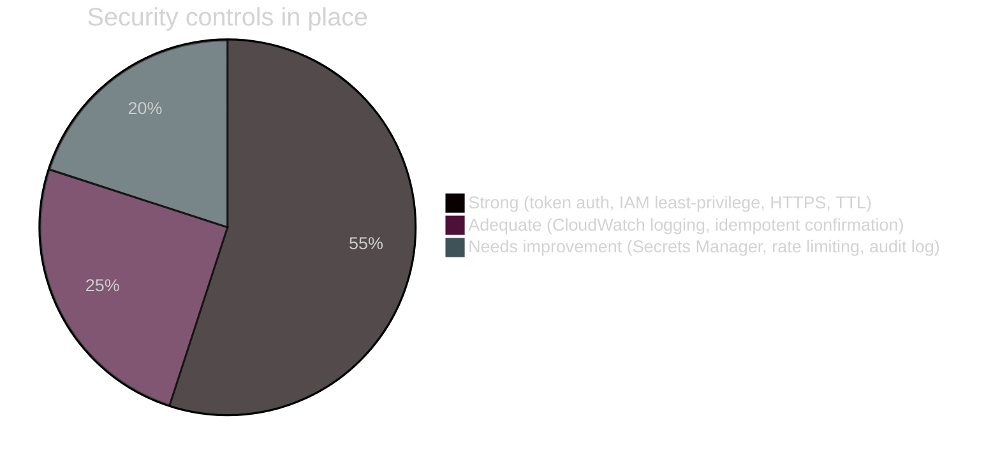

# Threat Model — Washing Machine Filter Reminder

> *This document applies enterprise-grade security analysis to a system whose primary adversary is domestic inertia. It is written in earnest.*

---

## Scope & Assumptions

**In scope:** All components of the reminder pipeline — API Gateway, Lambda functions, DynamoDB, SES, and the confirmation flow.

**Out of scope:** The washing machine itself, the filter, and the feelings of either.

**Assumptions:**
- The AWS account is managed responsibly and MFA is enabled
- `samconfig.toml` is gitignored and never committed
- The recipient is assumed to be non-malicious, merely busy

---

## System Data Flow & Trust Boundaries

```mermaid
%%{init: {'theme': 'dark', 'themeVariables': {'primaryColor': '#1e3a5f', 'primaryTextColor': '#c9d1d9', 'primaryBorderColor': '#4a7ab5', 'lineColor': '#58a6ff', 'edgeLabelBackground': '#0d1117', 'clusterBkg': '#0d1a2e', 'clusterBorder': '#30363d'}}}%%

flowchart TD
    subgraph internet ["🌐  Internet (Untrusted)"]
        USER["Recipient\n(browser / email client)"]
    end

    subgraph aws ["☁️  AWS Account (Trusted boundary)"]
        subgraph sched ["EventBridge"]
            EB["Scheduled rules\n(cron — no external trigger)"]
        end

        subgraph compute ["Lambda"]
            L1["SendWeeklyEmail"]
            L2["SendDailySMS"]
            L3["ConfirmTask"]
        end

        subgraph storage ["DynamoDB"]
            DB[("Reminders table\nPK · status · token · ttl")]
        end

        subgraph apigw ["API Gateway"]
            GW["GET /confirm\n(public endpoint)"]
        end
    end

    subgraph saas ["🔌  External SaaS"]
        SES["AWS SES\n(email delivery)"]
        TWILIO["Twilio\n(SMS — optional)"]
    end

    EB -->|"scheduled invoke\n(no user input)"| L1
    EB -->|"scheduled invoke"| L2
    L1 -->|"read/write"| DB
    L2 -->|"read/write"| DB
    L3 -->|"read/write"| DB
    L1 -->|"send email\n(confirm URL + token)"| SES
    L2 -->|"send SMS"| TWILIO
    SES -->|"SMTP/TLS"| USER
    TWILIO -->|"SMPP"| USER
    USER -->|"HTTPS GET\n?week=…&token=…"| GW
    GW -->|"invoke"| L3
    L3 -->|"send congratulations"| SES

    classDef trust fill:#0d2137,stroke:#1e4a7a
    classDef untrust fill:#2a1a1a,stroke:#7a1e1e
    classDef saas fill:#1a2a1a,stroke:#2a5a2a
```

---

## STRIDE Analysis

### Component: API Gateway — `GET /confirm`

The only internet-facing surface. Accepts `week` and `token` query parameters from anyone.

| Threat | Description | Likelihood | Impact | Mitigation |
|--------|-------------|:----------:|:------:|------------|
| **S** Spoofing token | Attacker guesses or brutes a valid `?token=` | 🟢 Very Low | 🟡 Medium | UUID v4 = 122 bits entropy. At 10,000 req/s it would take ~5 × 10²⁷ years. Comfortable. |
| **T** Parameter tampering | Manipulating `week` or `token` values | 🟢 Very Low | 🟢 Low | Invalid combinations return 403/404; no state is changed |
| **R** Repudiation | No proof of who clicked the link | 🟡 Medium | 🟡 Medium | `confirmed_at` timestamp written to DynamoDB; CloudWatch logs record the Lambda invocation |
| **I** Information disclosure | Error pages leaking internals | 🟢 Very Low | 🟢 Low | HTML error pages return no stack traces or internal details |
| **D** Denial of service | Flooding the `/confirm` endpoint | 🟡 Medium | 🟢 Low | No rate limiting configured. Risk is low — Lambda scales and the endpoint does almost nothing without a valid token |
| **E** Elevation of privilege | Gaining broader AWS access via the endpoint | 🟢 Very Low | 🔴 High | `ConfirmTask` IAM role is scoped to `dynamodb:GetItem/PutItem/UpdateItem/DeleteItem` on the single table and `ses:SendEmail` only |

---

### Component: Lambda Functions

| Threat | Description | Likelihood | Impact | Mitigation |
|--------|-------------|:----------:|:------:|------------|
| **S** Spoofing EventBridge source | Fake scheduled events triggering Lambdas | 🟢 Very Low | 🟡 Medium | EventBridge invokes Lambda via resource-based policy; only this account's rules can trigger |
| **T** Code tampering | Attacker modifying Lambda code | 🟢 Very Low | 🔴 High | Requires AWS account compromise; mitigated by MFA and least-privilege IAM |
| **I** Credential exposure | `TWILIO_AUTH_TOKEN`, `WHATSAPP_ACCESS_TOKEN` etc. visible in Lambda env | 🟡 Medium | 🔴 High | ⚠ **See recommendation below.** Currently stored as plaintext env vars — should be moved to AWS Secrets Manager |
| **I** PII in environment | `WIFE_EMAIL` and `WIFE_PHONE` in Lambda config | 🟡 Medium | 🟡 Medium | Visible to any IAM principal with `lambda:GetFunctionConfiguration`. Restrict this permission |
| **D** Lambda throttling | Concurrent invocations exhausted | 🟢 Very Low | 🟢 Low | Functions run at most a handful of times per day; account concurrency limits are not a realistic concern |

---

### Component: DynamoDB

| Threat | Description | Likelihood | Impact | Mitigation |
|--------|-------------|:----------:|:------:|------------|
| **T** Record tampering | Directly modifying task status or token | 🟢 Very Low | 🟡 Medium | Only the Lambda IAM role has DynamoDB access; no public endpoint |
| **R** No data-plane audit log | DynamoDB reads/writes not in CloudTrail by default | 🟡 Medium | 🟡 Medium | ⚠ **See recommendation below.** Enable CloudTrail data events for the table |
| **I** PII at rest | `sms_dates`, timestamps, status readable by account admins | 🟢 Low | 🟢 Low | Minimal PII stored; no email addresses or phone numbers in the table itself (stored in Lambda env only) |
| **D** Record flood | Attacker creating unlimited DynamoDB items | 🟢 Very Low | 🟡 Medium | All writes go through Lambda; Lambda is only invoked by EventBridge or valid API requests; no write path is publicly exposed |

---

### Component: Email Delivery (SES)

| Threat | Description | Likelihood | Impact | Mitigation |
|--------|-------------|:----------:|:------:|------------|
| **S** Email spoofing | Third party spoofing `guy@dunite.uk` | 🟡 Medium | 🟡 Medium | Ensure SPF and DKIM records are published for `dunite.uk`; SES handles DKIM signing automatically for verified domains |
| **T** Confirmation link interception | Link captured in transit or from inbox | 🟡 Medium | 🟡 Medium | Link is HTTPS; token is single-purpose; if clicked after already confirmed it is a no-op |
| **I** Link forwarding | Recipient forwards email; third party confirms | 🟡 Medium | 🟢 Low | Acceptable risk for this threat model. Worst case: filter recorded as cleaned when it wasn't — a domestic inconvenience, not a security incident |
| **D** SES sending quota | 200 emails/day sandbox limit (current); rate: 1/sec | 🟢 Very Low | 🟢 Low | Production access requested; system sends ~1–10 emails/week maximum |

---

## Risk Matrix

---

## Attack Tree — False Confirmation

The highest-value attack: convincing the system the filter has been cleaned when it hasn't.

**Conclusion:** The realistic attack path is email inbox access. This is outside the system's control — it is a property of the recipient's email security posture, not this application's.

---

## Findings & Recommendations

### 🔴 High Priority

| # | Finding | Recommendation |
|---|---------|---------------|
| 1 | **Credentials stored as Lambda environment variables** — Twilio Auth Token and WhatsApp Access Token are visible to any IAM principal with `lambda:GetFunctionConfiguration` | Migrate to **AWS Secrets Manager**. Fetch at Lambda cold start using `boto3.client('secretsmanager')`. Rotate tokens regularly. |

### 🟡 Medium Priority

| # | Finding | Recommendation |
|---|---------|---------------|
| 2 | **No API Gateway rate limiting** — `/confirm` endpoint has no throttle beyond Lambda account concurrency | Add a **Usage Plan** with a request rate limit (e.g. 10 req/s, 1,000 req/day) via API Gateway. At this scale, even 1 req/s would be more than sufficient. |
| 3 | **No DynamoDB CloudTrail data events** — reads and writes to the reminders table are not audited | Enable **CloudTrail data event logging** for the table. Cost is negligible at this volume. |
| 4 | **PII in Lambda environment** — `WIFE_EMAIL` and `WIFE_PHONE` visible in function config | Restrict `lambda:GetFunctionConfiguration` in the AWS account IAM policy to admin roles only. Consider also moving to Secrets Manager (see #1). |

### 🟢 Low Priority / Informational

| # | Finding | Recommendation |
|---|---------|---------------|
| 5 | **No confirmation non-repudiation** — only a timestamp proves the link was clicked, not who clicked it | Acceptable for this use case. If stronger proof is needed, log the User-Agent and source IP in CloudWatch. |
| 6 | **SPF/DKIM for `dunite.uk`** — SES signs outbound email, but SPF/DKIM records must be published in DNS | Verify in SES console that `dunite.uk` DKIM records are active. Check [MXToolbox](https://mxtoolbox.com) for SPF coverage. |
| 7 | **Test EventBridge rule left in stack** — `TestSMSEvery10Min` rule exists (disabled) | Acceptable — it is disabled by default. Consider removing from the template post-testing to reduce attack surface. |

---

## Security Posture Summary

| Area | Status |
|------|--------|
| Authentication | ✅ UUID v4 token — cryptographically strong |
| Authorisation | ✅ IAM roles scoped to minimum required actions |
| Encryption in transit | ✅ HTTPS enforced on API Gateway; SES uses TLS |
| Encryption at rest | ✅ DynamoDB encrypted at rest by default |
| Secrets management | ⚠️ Environment variables — should move to Secrets Manager |
| Audit logging | ⚠️ CloudWatch logs Lambda; DynamoDB data events not enabled |
| Rate limiting | ⚠️ No throttle on `/confirm` endpoint |
| Input validation | ✅ `week` parsed as ISO date; token compared with constant-time equality |
| Dependency supply chain | ✅ Minimal dependencies (`boto3`, optional `twilio`) |

---

*Threat model version 1.0 — May 2026. Review annually or when the architecture changes materially. Or when the filter starts answering back.*
