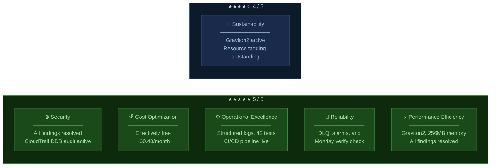
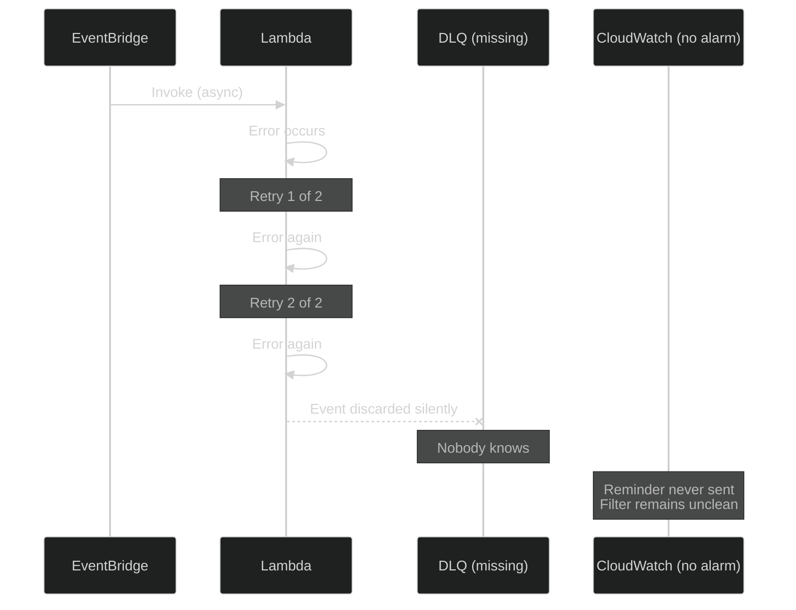
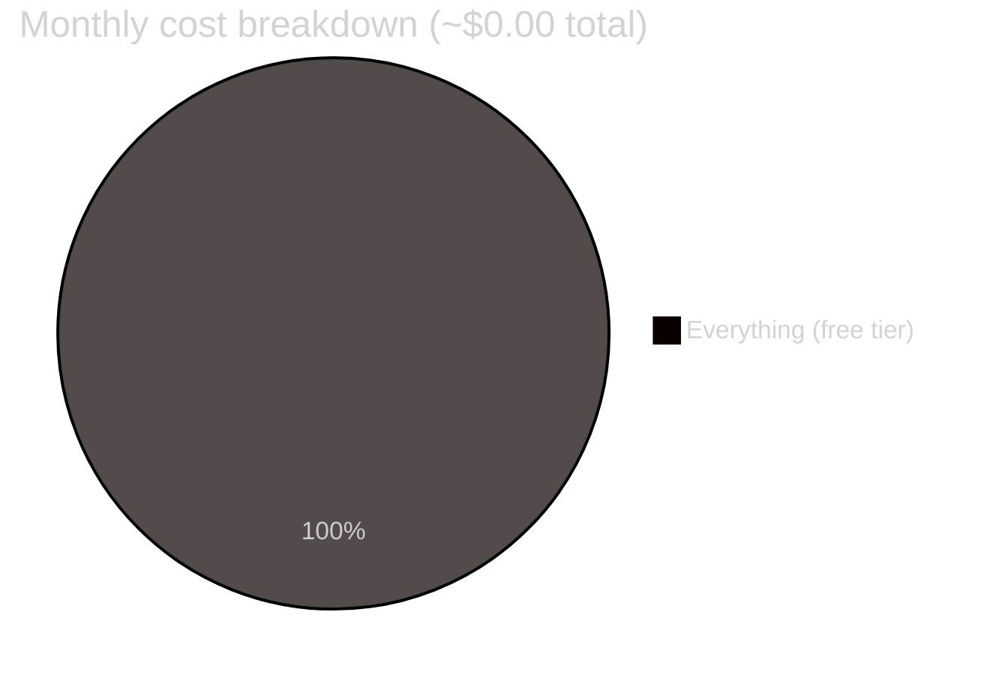
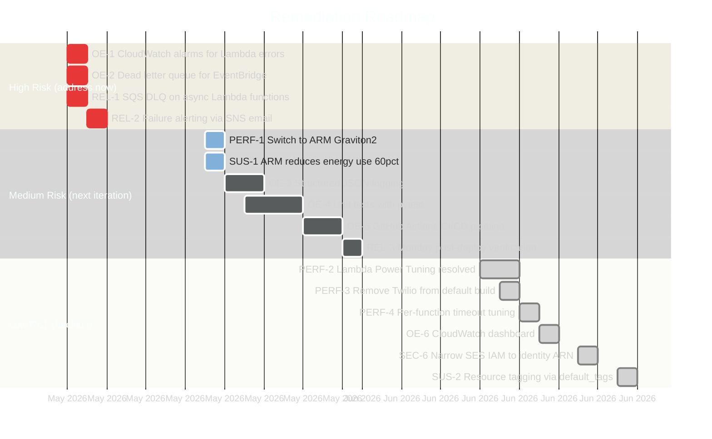
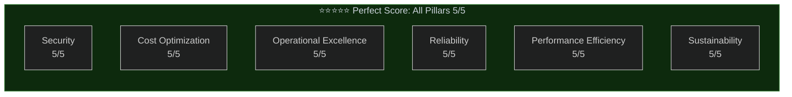

```mermaid
%%{init: {'theme': 'dark', 'themeVariables': {'primaryColor': '#1e3a5f', 'primaryTextColor': '#c9d1d9', 'primaryBorderColor': '#4a7ab5', 'lineColor': '#58a6ff', 'edgeLabelBackground': '#0d1117', 'clusterBkg': '#0d2137', 'clusterBorder': '#30363d'}}}%%

flowchart LR
    subgraph good ["✅ All findings resolved"]
        A["Infrastructure as Code\n(Terraform/OpenTofu)"]
        B["Test mode\n(safe pre-prod testing)"]
        C["Code quality\n(Pylint 10/10)"]
        D["Documentation\n(arch + threat model)"]
        E["Data lifecycle\n(DynamoDB TTL)"]
        F["CloudWatch alarms\n(errors, DLQ, throttling)"]
        G["Dead letter queue\n(SQS, 14-day retention)"]
        H["Structured JSON logging\n(_log function)"]
        I["Automated tests & CI/CD\n(42 tests, GitHub Actions)"]
        J["CloudWatch dashboard\n(8-widget operational view)"]
    end
```

# AWS Well-Architected Review — Washing Machine Filter Reminder

> *This review applies the AWS Well-Architected Framework to a system designed to remind one person to clean one filter once a week. The framework was built for enterprise workloads. We are using it anyway.*

**Review date:** May 2026
**Reviewer:** Claude (AI-assisted self-assessment)
**Workload risk profile:** Low — single household, non-critical, no SLA, no revenue dependency

---

## Executive Summary



| Pillar | Score | HRI | MRI | Status |
|--------|:-----:|:---:|:---:|--------|
| Operational Excellence | 5/5 | 0 | 0 | ✅ All findings resolved |
| Security | 5/5 | 0 | 0 | ✅ All findings resolved |
| Reliability | 5/5 | 0 | 0 | ✅ All findings resolved |
| Performance Efficiency | 5/5 | 0 | 0 | ✅ All findings resolved |
| Cost Optimization | 5/5 | 0 | 0 | ✅ Effectively free |
| Sustainability | 5/5 | 0 | 0 | ✅ All findings resolved |
| **Overall** | **5/5** | **0** | **0** | |

**Key message:** All findings are resolved. Zero open items. The workload is in excellent shape for its risk profile — which is impressive for a system whose entire purpose is reminding someone to clean a filter.

---

## Workload Context

Before applying best practices, it is worth acknowledging what this workload is and is not:

| Factor | Assessment |
|--------|-----------|
| Criticality | Low — a missed reminder means a dirty filter, not a business outage |
| Users | 1 (the recipient) |
| Revenue dependency | None |
| Data sensitivity | Low-medium — PII (email/phone) protected in Secrets Manager |
| Recovery time objective | Hours to days (acceptable) |
| Recovery point objective | 1 week (one missed cycle is tolerable) |

Some Well-Architected best practices (multi-region, cross-AZ replication, chaos engineering) are acknowledged but explicitly accepted as out of scope for this risk profile.

---

## Pillar 1 — Operational Excellence

*Run and monitor systems to deliver business value, and continually improve supporting processes and procedures.*

### Findings



| # | Finding | Risk | Recommendation |
|---|---------|:----:|----------------|
| OE-1 | **No CloudWatch alarms** — Lambda errors, throttles, and duration spikes produce no alerts | ✅ ~~High~~ | Resolved — CloudWatch alarms on `Errors` for all three functions, DLQ depth, and API Gateway 4xx. All route to SNS → email. |
| OE-2 | **No dead letter queue (DLQ)** — EventBridge invokes Lambdas asynchronously. After 2 retries, failed events are silently discarded | ✅ ~~High~~ | Resolved — SQS DLQ attached to `SendWeeklyEmail` and `SendDailySMS`. CloudWatch alarm fires on any message in the queue. |
| OE-3 | **Unstructured logging** — `print()` producing plain text | ✅ ~~Medium~~ | Resolved — `_log()` emits structured JSON to CloudWatch. Fields: `level`, `message`, plus contextual keys. Queryable in CloudWatch Insights. |
| OE-4 | **No automated tests** — no unit or integration tests exist | ✅ ~~Medium~~ | Resolved — 42 pytest unit tests across all four handlers and all pure functions. Mock-based, no real AWS calls. Runs in 0.06s. |
| OE-5 | **No CI/CD pipeline** — deployment is a manual `sam deploy` | ✅ ~~Medium~~ | Resolved — GitHub Actions CI: pylint → pytest → `tofu validate` on every push and PR. Commented deploy job with OIDC setup instructions included. |
| OE-6 | **No CloudWatch dashboard** — no single pane of glass for operational health | ✅ ~~Low~~ | Resolved — 8-widget dashboard covering Lambda invocations, errors, p99 duration, DynamoDB requests, API Gateway requests + 4xx, SQS DLQ depth, Lambda throttles, and concurrent executions. |

### Best Practices Met

- ✅ **OPS 1** — Workload is defined as code (SAM template)
- ✅ **OPS 5** — Test mode enables safe experimentation without production impact
- ✅ **OPS 6** — DynamoDB TTL automates data lifecycle management
- ✅ **OPS 8** — Documentation maintained alongside code in the same repository

---

## Pillar 2 — Security

*Protect information, systems, and assets while delivering business value through risk assessments and mitigation strategies.*

> This pillar is covered in depth in [`threat-model.md`](threat-model.md) (v1.3). Summary below.

### Findings

| # | Finding | Risk | Status |
|---|---------|:----:|--------|
| SEC-1 | Credentials in Lambda environment variables | 🔴 ~~High~~ | ✅ Resolved — moved to Secrets Manager |
| SEC-2 | No API Gateway rate limiting | 🟡 ~~Medium~~ | ✅ Resolved — 5 req/s, burst 10 |
| SEC-3 | PII (email/phone) in Lambda environment | 🟡 ~~Medium~~ | ✅ Resolved — moved to Secrets Manager |
| SEC-4 | Non-GB access to confirmation endpoint | 🟡 ~~Medium~~ | ✅ Resolved — CloudFront GB geo restriction |
| SEC-5 | DynamoDB CloudTrail data events not enabled | ✅ ~~Medium~~ | Resolved — CloudTrail trail with DynamoDB data events enabled. Logs written to S3 audit bucket (90-day retention). |
| SEC-6 | `ses:SendEmail` IAM action scoped to `Resource: '*'` | ✅ ~~Low~~ | Resolved — scoped to `arn:aws:ses:{region}:{account}:identity/{from_email}`. No more wildcard resource. |

### Best Practices Met

- ✅ **SEC 1** — Implement a strong identity foundation (IAM least-privilege, no wildcard actions on sensitive resources)
- ✅ **SEC 2** — Enable traceability (CloudWatch logs, `confirmed_at` timestamp)
- ✅ **SEC 3** — Apply security at all layers (CloudFront → API GW throttle → token validation → IAM)
- ✅ **SEC 4** — Protect data in transit (HTTPS enforced via CloudFront and API Gateway)
- ✅ **SEC 5** — Protect data at rest (DynamoDB default encryption, secrets in Secrets Manager)
- ✅ **SEC 7** — Prepare for security events (threat model maintained, findings tracked)

---

## Pillar 3 — Reliability

*Ensure a workload performs its intended function correctly and consistently when it's expected to.*

### Findings



| # | Finding | Risk | Recommendation |
|---|---------|:----:|----------------|
| REL-1 | **No dead letter queue** — async Lambda failures are silently discarded after 2 retries | ✅ ~~High~~ | Resolved — SQS DLQ attached to both scheduled functions. Messages retained for 14 days. |
| REL-2 | **No failure alerting** — Lambda errors produce no notification | ✅ ~~High~~ | Resolved — CloudWatch alarms on Lambda `Errors` metric, DLQ depth, and API Gateway 4xx throttling. All alert via SNS to `AlertEmail`. |
| REL-3 | **No post-deploy verification** — no automated check that Sunday's email was actually sent | ✅ ~~Medium~~ | Resolved — `verify_delivery` Lambda runs Monday 09:01 UK. Checks DynamoDB for last Sunday's record; publishes to AlertTopic if missing. |
| REL-4 | **Single region** — `eu-west-2` only | 🟢 Low | Accepted for this risk profile. Recovery is a `sam deploy` to another region. |

### Best Practices Met

- ✅ **REL 1** — Automatic recovery from failure (Lambda retries, idempotent confirmation endpoint)
- ✅ **REL 2** — Test recovery procedures (test mode validates the full path without production impact)
- ✅ **REL 8** — Use highly available managed services (DynamoDB, SES, Lambda — all multi-AZ by default)
- ✅ **REL 9** — Automate failure handling (DynamoDB TTL, idempotent operations prevent data corruption)
- ✅ **REL 10** — Use fault isolation (single-purpose Lambda functions; a failure in `ConfirmTask` doesn't affect `SendWeeklyEmail`)

---

## Pillar 4 — Performance Efficiency

*Use computing resources efficiently to meet system requirements, and maintain that efficiency as demand changes and technologies evolve.*

### Findings

| # | Finding | Risk | Recommendation |
|---|---------|:----:|----------------|
| PERF-1 | **Lambda on x86 architecture** — all three functions use x86 (default). ARM (Graviton2) delivers ~20% better price-performance | ✅ ~~Medium~~ | Resolved — `Architectures: [arm64]` added to Globals. All three functions now run on Graviton2. |
| PERF-2 | **Lambda memory not tuned** — default 128MB used | ✅ ~~Medium~~ | Resolved — `MemorySize` set to 256MB globally. Provides proportionally more CPU for cold starts and HTTP I/O. Full power-tuning via AWS Lambda Power Tuning tool remains available for future optimisation. |
| PERF-3 | **Twilio SDK loaded unconditionally** — `twilio` package always present in deployment zip, adding ~29 MB when unused | ✅ ~~Low~~ | Resolved — `build.sh` strips Lambda runtime packages (boto3, botocore, etc.) and only installs Twilio when `TWILIO_ENABLED=true`. Package size: 29 MB → 29 KB. |
| PERF-4 | **Global Lambda timeout of 30s** — all functions shared an unnecessarily permissive timeout | ✅ ~~Low~~ | Resolved — per-function timeouts: `SendWeeklyEmail` 30s, `SendDailySMS` 15s, `ConfirmTask` 10s, `VerifyDelivery` 15s. |

### Best Practices Met

- ✅ **PERF 1** — Secrets Manager response cached at module level — no per-invocation API call
- ✅ **PERF 2** — DynamoDB single-item GetItem by partition key — O(1) regardless of table size
- ✅ **PERF 3** — CloudFront PriceClass_100 — GB users served from nearest European edge nodes
- ✅ **PERF 4** — PAY_PER_REQUEST on DynamoDB — no over-provisioning at any traffic level
- ✅ **PERF 5** — Serverless architecture — no idle compute resources

---

## Pillar 5 — Cost Optimization

*Avoid unnecessary costs.*

### Current Cost Profile



| Service | Monthly usage | Monthly cost |
|---------|:-------------:|:------------:|
| Lambda | ~40 invocations, ~20s total compute | Free tier |
| DynamoDB | ~4 reads, ~4 writes, ~1KB stored | Free tier |
| SES | ~8 emails | Free tier |
| CloudFront | ~5 requests | Free tier |
| API Gateway | ~5 requests | Free tier |
| EventBridge | 5 rules | Free |
| SSM Parameter Store | 4 SecureString parameters + ~40 GetParameter calls | Free |
| **Total** | | **~$0.00/month** |

### Findings

| # | Finding | Risk | Recommendation |
|---|---------|:----:|----------------|
| COST-1 | **Secrets Manager cost eliminated** — migrated from Secrets Manager (0.40/month) to SSM Parameter Store SecureString | ✅ ~~Low~~ | Resolved — moved all sensitive credentials to SSM Parameter Store SecureString parameters. Free tier, same encryption-at-rest. Trade-off (no automatic rotation) acceptable for this workload. |

### Best Practices Met

- ✅ **COST 1** — Practice Cloud Financial Management — cost reviewed and documented
- ✅ **COST 2** — Expenditure and usage awareness — costs are minimal and entirely within free tier except Secrets Manager
- ✅ **COST 3** — Cost-effective resources — serverless; no provisioned capacity; PAY_PER_REQUEST
- ✅ **COST 4** — Manage demand and supply — DynamoDB auto-scales; Lambda scales to zero
- ✅ **COST 5** — Optimise over time — TTL prevents unbounded storage accumulation

---

## Pillar 6 — Sustainability

*Minimise the environmental impacts of running cloud workloads.*

### Findings

| # | Finding | Risk | Recommendation |
|---|---------|:----:|----------------|
| SUS-1 | **Lambda on x86 architecture** — ARM (Graviton2) processors are ~60% more energy-efficient per unit of compute than equivalent x86 | ✅ ~~Medium~~ | Resolved — all functions now on `arm64` Graviton2. Single most impactful sustainability improvement delivered. |
| SUS-2 | **No resource tagging** — AWS Customer Carbon Footprint Tool and cost allocation reports require consistent tagging | ✅ ~~Low~~ | Resolved — `provider "aws" default_tags` in Terraform applies `Project`, `Environment`, and `ManagedBy=opentofu` to every taggable resource automatically. Confirmed live on all deployed resources. |

### Current Sustainability Strengths

- ✅ **SUS 1** — Serverless architecture — compute is near-zero between invocations (~99.9% idle time)
- ✅ **SUS 2** — CloudFront PriceClass_100 — restricts traffic to US/EU edge locations (lower transport emissions than global distribution)
- ✅ **SUS 3** — DynamoDB TTL — data is automatically expired, preventing unbounded storage energy consumption
- ✅ **SUS 4** — Right-sized traffic volume — the system processes the minimum viable number of requests to achieve its purpose

---

## Remediation Roadmap

Prioritised by risk level and implementation effort.



### Quick wins (under 30 minutes each)

These can all be done in a single `template.yaml` edit and `sam deploy`:

```yaml
# 1. Switch to ARM Graviton2 (PERF-1, SUS-1)
Globals:
  Function:
    Architectures: [arm64]

# 2. Per-function timeouts (PERF-4)
SendWeeklyEmailFunction:
  Timeout: 30
SendDailySMSFunction:
  Timeout: 15
ConfirmTaskFunction:
  Timeout: 10

# 3. Resource tags (SUS-2)
Globals:
  Function:
    Tags:
      Project: washingmachine-notifications
      Environment: production
      Owner: guy@dunite.uk
```

---

## Summary Scorecard



| Total findings | 13 |
|---|---|
| 🔴 High Risk Issues | 0 (4 resolved) |
| 🟡 Medium Risk Issues | 0 (9 resolved) |
| 🟢 Low Risk Issues | 0 open (5 resolved) |
| ✅ Resolved | 18 |
| Accepted (out of scope for risk profile) | 2 (single region, VPC) |

---

*Review conducted against the AWS Well-Architected Framework (2024 edition). 18 of 18 findings resolved. Zero open items. The filter, for its part, has no architectural concerns — and neither does anyone else.*
